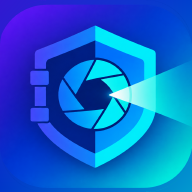

<!-- markdownlint-disable MD033 MD041 -->
<p align="center">
  
</p>

<h1 align="center">📱 LumoVault</h1>

<p align="center">
  <strong>Original-quality photo &amp; video backup, powered by your own Telegram channel.</strong>
</p>

<p align="center">
  Never lose another photo. LumoVault backs up your device photos and videos to a channel
  <b>you</b> own on Telegram — no compression, no third-party cloud. A built-in metadata layer
  travels with your files, so a second device can restore the same catalog: albums, captions,
  statuses, and timestamps.
</p>

<p align="center">
  <a href="#-features">Features</a> •
  <a href="#-security--privacy">Security</a> •
  <a href="#-getting-started">Get Started</a> •
  <a href="#-configuration">Configuration</a> •
  <a href="#-how-it-works">How it works</a> •
  <a href="#-faq">FAQ</a> •
  <a href="#-status">Status</a>
</p>

<p align="center">
  
  
  
  
</p>

---

## ✨ Features

| | |
| :--- | :--- |
| 🗂️ **Original-quality backup** | Files uploaded as documents via TDLib — never recompressed. |
| 📁 **Opt-in folder selection** | Choose exactly which device folders to back up. |
| ⚡ **Incremental scanning + dedup** | SHA-256 hashing means only new or changed files are uploaded. |
| 🔄 **Background, periodic backup** | WorkManager keeps the queue moving, with progress notifications. |
| 📅 **Unified timeline** | Date-grouped view merging local items with items in your channel. |
| 🖼️ **Local gallery** | Local, Timeline, Map, Search, media viewer with video playback. |
| 📥 **Restore** | Scan your Telegram channel and download items back to the device. |
| 🧬 **Metadata sync** | Albums, captions, and state mirrored as JSON manifests/partitions. |
| 🗑️ **Trash with auto-purge** | Deleted items rest for 30 days before permanent removal. |
| 🙈 **Hidden album &amp; Archive** | Keep sensitive or old items out of the main views. |
| 👤 **People (Faces)** | ONNX-powered face detection, clustering, and person grouping. |
| 🔒 **App lock** | PIN plus optional biometric unlock. |
| 🩺 **Crash reporting** | Sentry in release builds (opt-in via `SENTRY_DSN`). |

## 🔒 Security & Privacy

LumoVault is designed so your files live in **your** Telegram account, not on anyone else's
servers. Here's the honest, precise picture of what that does and does not mean:

- **Your own storage.** Backups go to a private channel that LumoVault creates in your account.
  There is no LumoVault backend — no third-party cloud ever receives your media.
- **Encrypted in transit.** All traffic to Telegram uses their MTProto protocol. Files are **not**
  end-to-end encrypted at rest: they live in your Telegram cloud storage, so anyone with access to
  your Telegram account can see them. Treat your Telegram account security (2FA!) as the perimeter.
- **Plaintext metadata.** Captions, album names, and sync manifests are stored as **plaintext JSON**
  in your channel so a second device can rebuild the catalog. Don't put secrets in captions.
- **Encrypted local session.** The on-device TDLib database is encrypted with a 32-byte key held in
  `flutter_secure_storage` (Android Keystore-backed).
- **App lock.** Optional PIN and biometric unlock, with a "require auth on app open" toggle.
- **No secrets in source.** Telegram API credentials are injected at build time via `--dart-define`
  (see [Configuration](#-configuration)); nothing sensitive is committed.

## 🚀 Getting Started

### Prerequisites

- **Flutter 3.44.6 stable** (Dart ^3.12.2)
- An Android device or emulator (Android only — see [notes](#-technical-details))
- A Telegram account and your own **API ID / API hash**

### 1. Get your Telegram API credentials

1. Sign in at [my.telegram.org](https://my.telegram.org).
2. Open **API development tools** and create an app.
3. Copy the **App api_id** and **App api_hash** — you'll pass these at build time.

> LumoVault connects to Telegram as a client app using *your* credentials and uses a channel you
> own as storage. The credentials never leave your build.

### 2. Run

```sh
flutter pub get
flutter run \
  --dart-define=LUMOVAULT_TELEGRAM_API_ID=<your_api_id> \
  --dart-define=LUMOVAULT_TELEGRAM_API_HASH=<your_api_hash>
```

### 3. Build an APK

```sh
flutter build apk --debug \
  --dart-define=LUMOVAULT_TELEGRAM_API_ID=<your_api_id> \
  --dart-define=LUMOVAULT_TELEGRAM_API_HASH=<your_api_hash>
```

> 💡 No local Android SDK required for releases — CI builds and uploads the APK as an artifact.

## 🔧 Configuration

Build-time values are injected with `--dart-define` (or `--dart-define-from-file`). See
[`.env.example`](.env.example) for a copy-paste template.

| Define | Required | Purpose |
| :--- | :---: | :--- |
| `LUMOVAULT_TELEGRAM_API_ID` | ✅ | Telegram API ID from my.telegram.org. Defaults to `0` (fails fast). |
| `LUMOVAULT_TELEGRAM_API_HASH` | ✅ | Telegram API hash from my.telegram.org. |
| `SENTRY_DSN` | — | Enables Sentry crash reporting in release builds. |

Prefer keeping credentials out of your shell history? Use a define file:

```sh
flutter run --dart-define-from-file=.env.json
```

```json
{
  "LUMOVAULT_TELEGRAM_API_ID": 123456,
  "LUMOVAULT_TELEGRAM_API_HASH": "your_32_char_hex_hash"
}
```

## 🧩 How it works

```
 📱 Device photos & videos
      │
      │  incremental scan (photo_manager) + SHA-256 hashing
      ▼
 📤 Upload queue (drift-persisted)
      │
      │  TDLib document upload — original quality
      ▼
 📦 Your Telegram channel
      │
      │  channel scan + manifest/partition JSON
      ▼
 📅 Timeline   📥 Restore   🧬 Metadata sync
```

## ⚙️ Technical Details

### Tech stack

| Area | Choice |
| :--- | :--- |
| 🎨 Language / framework | **Flutter 3.44.6** (stable), Dart ^3.12.2 |
| 🧠 State management | Riverpod 2.6.1 |
| 🧭 Navigation | go_router 14.8.1 |
| 🗄️ Database | drift 2.20 (SQLite, codegen) |
| 🖼️ Media scanning | photo_manager |
| 📨 Telegram client | TDLib (`tdlib` package) |
| ⏰ Background work | workmanager (+ vendored patched `workmanager_android`) |
| 🔐 Secure storage | flutter_secure_storage |
| ✅ Permissions | permission_handler |
| ▶️ Video playback | video_player |
| 🗺️ Mapping | flutter_map (OpenStreetMap), latlong2, geolocator |
| 👤 Face detection | flutter_onnxruntime (SCRFD + ArcFace) |
| 🔐 Biometric auth | local_auth |
| 🔋 Battery state | battery_plus |
| 🔔 Notifications | flutter_local_notifications |
| 🎨 Dynamic theming | dynamic_color (Material You) |
| 🩺 Crash reporting | sentry_flutter |

> **Platform:** Android only (minSdk 23, target/compile 36). There is no iOS
> target configured — the TDLib native loading has Linux/Windows branches for
> desktop debugging, but the app ships Android-only.

> **Vendored dependency:** `packages/workmanager_android` is a patched fork of
> `workmanager_android` (upstream 0.9.0+2 does not register plugins on the
> background isolate's `FlutterEngine`). Re-check upstream before bumping
> `workmanager`; drop the `dependency_overrides` entry once fixed upstream.

### Project structure

```
lib/
├── core/            # DI, drift DB, storage, security, router, errors, TDLib, logging
├── features/
│   ├── onboarding/  # Welcome → permissions → folders → Telegram connect
│   ├── gallery/     # Local, Timeline, Map, Search, media viewer
│   ├── backup/      # Dashboard, upload queue, engine, scheduler
│   ├── restore/     # Channel scan, restore engine, progress
│   ├── metadata/    # Manifests/partitions, sync coordinator, search index
│   ├── app_lock/    # PIN + biometric gate
│   ├── hidden/      # Hidden album
│   ├── archive/     # Archived items
│   ├── people/      # Face detection, clustering, person grouping
│   ├── trash/       # Trash with 30-day retention
│   └── settings/    # Storage, privacy, notifications, appearance, …
├── shared/          # Lumo design-system widgets, shared providers
└── main.dart

packages/workmanager_android/  # Vendored plugin, patched to register plugins
                               # on the background isolate
test/                          # Unit + widget tests (mirrors lib/)
```

### Testing & quality

```sh
flutter test          # 953 tests (unit + widget)
dart format --output=none --set-exit-if-changed .
dart analyze
```

### CI

[`.github/workflows/ci.yml`](.github/workflows/ci.yml) runs on manual dispatch (`workflow_dispatch`):

1. **Analyze** — format check + `dart analyze --fatal-infos`
2. **Test** — `flutter test --coverage`, uploaded to Codecov
3. **Build APK** — debug APK, uploaded as an artifact

The build job needs two repository secrets — `LUMOVAULT_TELEGRAM_API_ID` and
`LUMOVAULT_TELEGRAM_API_HASH` (Settings → Secrets and variables → Actions).

## ❓ FAQ

**Is my data end-to-end encrypted?**
No. Files sit in your Telegram cloud storage (encrypted in transit, not E2E at rest). Your Telegram
account — ideally with 2FA — is the security boundary. See [Security & Privacy](#-security--privacy).

**Does it work on iOS?**
Not currently. There is no iOS target configured; the app ships Android-only.

**Will it re-upload everything after a reinstall?**
No. Uploads are deduplicated by SHA-256, and the upload queue is persisted, so scans only enqueue
new or changed files.

**Can I restore to a second device?**
Yes. The metadata layer mirrors albums, captions, and state as JSON in your channel, so another
device can rebuild the same catalog after scanning it.

## 📍 Status

Early stage (v1.0.0). Current focus areas:

- 🔧 Reliability hardening of the backup/scan pipeline and background sync
- 🖼️ Thumbnail handling in the timeline and gallery views
- 🔄 Cross-device metadata restore
